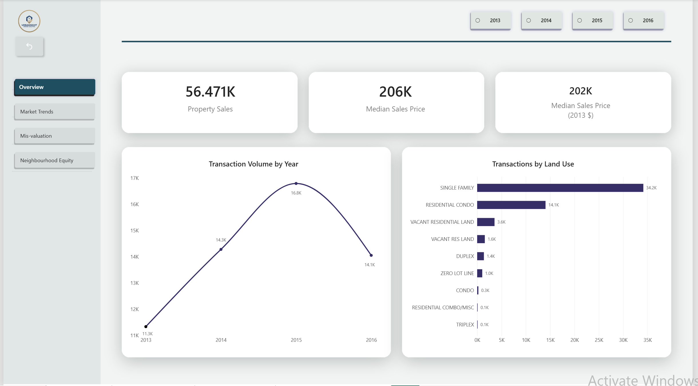
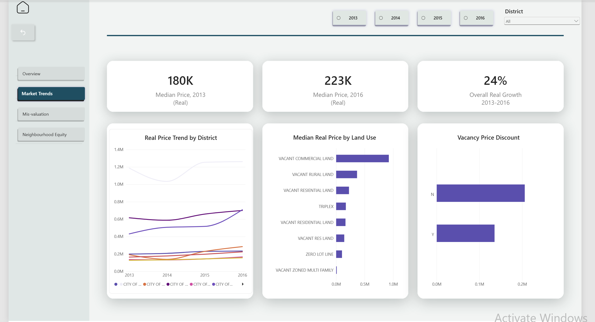
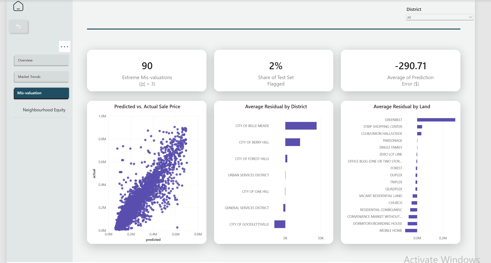
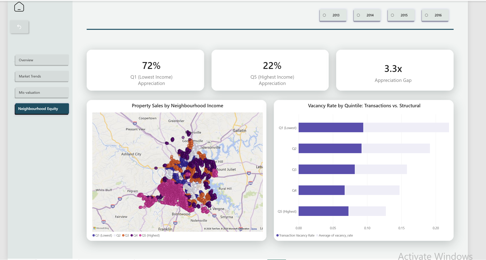

# Nashville Property Analytics

A forensic analysis of the Nashville housing market across 56,468 property transactions from 2013 to 2016. The project investigates what drives property value, how the market treated different neighbourhoods differently, and how real purchasing power shifted once inflation is accounted for.

The dataset has no latitude, longitude, or demographic information attached to it. Those had to be built, addresses were geocoded via the Census Bureau's batch API, Census tract identifiers were extracted, and American Community Survey demographic data was joined at the tract level. The result is a dataset that connects individual property transactions to the income characteristics of the neighbourhood they sit in.

---

## What the project covers

**Data quality audit (Notebook 01)**
The raw dataset has a 54% structural null rate across all assessment-side fields — bedrooms, finished area, land value, building value. This is not random data entry failure. It is a failed join between a transaction table and a property assessment table in the source data. Every record missing one assessment field is missing all of them. 103 sets of true duplicate rows were identified and removed, representing $67.6M in phantom transaction value if taken at face value. Findings are quantified, not just noted.

**Price and vacancy analysis (Notebook 02)**
All sale prices are adjusted to 2013 base dollars using BLS CPI-U series CUUR0000SA0 so comparisons across years reflect real purchasing power, not nominal movement. Vacant properties sell at a statistically significant discount confirmed by Mann-Whitney U test, a t-test would have been the wrong choice here because sale price distributions are right-skewed and violate the normality assumption. Land use composition remained stable across the dataset period, which means rising median prices reflect genuine appreciation rather than a shift toward more expensive property types in the transaction mix.

**Predictive modelling and mis-valuation detection (Notebook 03)**
Four models were built on the 46% of records with complete assessment-side fields: Linear Regression, Ridge, Lasso, and Random Forest. All three regression models performed near-identically, the issue was not multicollinearity but non-linearity in the relationships. Random Forest was the best model at R² 78.8%, RMSE $74,385, MAE $47,638. Land value (importance 0.37) and building value (0.22) together account for 59% of predictive power. 90 extreme mis-valuation records were identified and standardised residuals above 3 (51 overvalued, 39 undervalued), with 75 of the 90 concentrated in the Urban Services District. The model is reliable below $400k and unreliable above $500k.

**Census demographic enrichment (Notebook 04)**
56,468 property addresses were geocoded to Census tract identifiers using the Census Geocoder batch API (97.6% match rate). ACS 5-Year Estimates (2016) for Davidson County were pulled at the tract level and joined to property records. The core finding is counterintuitive: the lowest-income neighbourhoods appreciated 71.9% in real terms from 2013 to 2016, versus 21.8% in the highest-income neighbourhoods, a 3.5x difference. Despite this, the absolute dollar gap between the cheapest and most expensive neighbourhoods did not close meaningfully. Structural neighbourhood vacancy fell consistently from 10.5% in the lowest-income tracts to 4.5% in the highest.

---

## Power BI executive dashboard

Notebooks work if someone's willing to read code. Not everyone is. The dashboard covers the same ground as Notebooks 02 through 04, four pages built in Power BI Desktop, for anyone who wants the findings without opening a single `.ipynb`.

**Why a static CSV extract instead of a live MySQL connection.** Power BI Desktop is Windows-only, so it runs through Parallels on this machine. A live connection from inside that Windows VM back into the Mac's MySQL instance would add networking complexity that has nothing to do with the analysis, and it's the kind of setup that tends to break on a machine other than the one it was built on. Three CSVs are exported instead, using `sql/05_dashboard_extract.sql` and `src/export_dashboard_data.py`. Re-running the export script refreshes the dashboard if the underlying data changes. Less live, more reproducible.

**The four pages:**

- **Overview** — KPI cards and trend lines across all 56,468 transactions, filterable by sale year. The 54% structural null rate on assessment-side fields is noted directly on the KPI cards, so the numbers don't look wrong to someone filtering by those fields.
- **Market Trends** — Real price and growth by tax district and year, same 56,468-row base as Overview.
- **Mis-valuation** — Scoped to the 4,632-row held-out test set from Notebook 03's Random Forest model, not the full dataset. These are the properties the model never saw during training, which is the only reason its predictions on them mean anything. Including training-set predictions here would make the model look more accurate than it is. 90 records cross the mis-valuation threshold (51 overvalued, 39 undervalued), 75 of them in the Urban Services District.
- **Neighbourhood Equity** — Appreciation and vacancy by income quintile, built from the 43,819 geocoded and demographic-enriched records from Notebook 04.






The interactive file is `reports/powerbi/Nashville_exec_dash.pbix`. GitHub can't render it inline, so it needs Power BI Desktop to open. The screenshots above are there for anyone browsing the repo without Power BI installed.

---

## Repository structure

```
nashville-property-analytics/
├── data/
│   ├── raw/          # Original CSV — never modified after download
│   └── processed/    # Geocoded addresses, demographics, enriched dataset
├── sql/
│   ├── 01_schema.sql
│   ├── 02_cleaning_queries.sql
│   ├── 03_analytical_queries.sql
│   ├── 04_analytical_queries.sql
│   └── 05_dashboard_extract.sql
├── notebooks/
│   ├── 01_data_audit.ipynb
│   ├── 02_exploratory_analysis.ipynb
│   ├── 03_modelling.ipynb
│   └── 04_census_enrichment.ipynb
├── src/
│   ├── load_raw.py
│   └── export_dashboard_data.py
├── reports/
│   ├── fig01–fig16 (PNG charts from all four notebooks)
│   ├── nashville_executive_summary.xlsx
│   └── powerbi/
│       ├── Nashville_exec_dash.pbix
│       ├── overview_trends.csv
│       ├── misvaluation.csv
│       ├── neighbourhood_equity.csv
│       └── screenshots/
│           ├── 01_overview.png
│           ├── 02_market_trends.png
│           ├── 03_misvaluation.png
│           └── 04_neighbourhood_equity.png
├── environment.yml
└── README.md
```

---

## How to run this project

**Prerequisites:** miniconda or conda, MySQL 8.0, a Census API key (free at api.census.gov/data/key_signup.html), a BLS API key (free at bls.gov/developers).

**1. Clone the repository**

```bash
git clone https://github.com/selete-tetteh/nashville-property-analytics.git
cd nashville-property-analytics
```

**2. Create the conda environment**

The environment is locked to `osx-64` because `r-rmariadb` has no ARM build on conda-forge. It runs under Rosetta 2 on Apple Silicon without issues.

```bash
CONDA_SUBDIR=osx-64 conda env create -f environment.yml
conda activate nashville-analytics
conda config --env --set subdir osx-64
```

**3. Set up credentials**

Create a `.env` file in the project root. Wrap the password in double quotes if it contains `$` or `@`:

```
DB_HOST=localhost
DB_PORT=3306
DB_NAME=nashville_analytics
DB_USER=root
DB_PASSWORD="your_password"
BLS_API_KEY=your_bls_key
CENSUS_API_KEY=your_census_key
```

**4. Create the MySQL database and load raw data**

Run `sql/01_schema.sql` in MySQL Workbench to create the database and raw table. Then load the raw CSV:

```bash
python src/load_raw.py
```

This drops the pandas index columns, normalises column names to snake_case, and loads 56,636 rows into `nashville_housing_raw`.

**5. Run the notebooks in order**

Open VS Code, select the `nashville-analytics` kernel, and run each notebook from top to bottom:

```
notebooks/01_data_audit.ipynb
notebooks/02_exploratory_analysis.ipynb
notebooks/03_modelling.ipynb
notebooks/04_census_enrichment.ipynb
```

Each notebook is self-contained. Notebook 04 geocodes 45,073 addresses across five batches — this step takes 20–40 minutes on first run and is skipped automatically on subsequent runs once the output file exists.

**Note for non-Mac users:** The `osx-64` platform lock in `environment.yml` is Mac-specific. On Linux or Windows, remove the `osx-64` constraint and install `r-rmariadb` directly from conda-forge.

---

## Key technical decisions

**SQL for source data.** The MySQL warehouse is the single authoritative store for all source and cleaned data. Derived analytical columns computed from external sources (CPI-adjusted prices, Census demographics) are computed in notebooks and saved as processed CSVs — they are not written back to the database. This keeps the database clean and the analytical pipeline reproducible.

**Geocoding rather than a FIPS crosswalk.** The housing dataset has street addresses but no Census tract identifiers. The only reliable way to join demographic data was to geocode each address to lat/lon coordinates and extract the Census tract FIPS code directly from the geocoder response. A crosswalk table approach was not viable because no geographic identifier in the dataset maps directly to Census tract boundaries.

**CPI adjustment using annual averages computed from monthly data.** The BLS public API endpoint returns monthly CPI values rather than the M13 annual average when called without elevated permissions. Annual averages are computed from the 12 monthly readings, which is exactly how BLS derives M13, the result is identical.

**Mann-Whitney U over t-test for vacancy discount analysis.** Sale price distributions are right-skewed. The t-test assumes normality. Mann-Whitney tests whether values from one group tend to be higher than the other without making any distributional assumption, which is the correct choice for this data.

**Random Forest over regression for modelling.** All three regression models (Linear, Ridge, Lasso) performed near-identically, which confirmed the issue was non-linearity rather than multicollinearity. Random Forest captures non-linear relationships natively and outperformed the regression suite on every metric.

---

## Data sources

- Nashville housing transactions 2013–2016 — Kaggle (Nashville Housing dataset)
- US CPI-U all-items index — Bureau of Labor Statistics, series CUUR0000SA0
- Census tract boundaries and demographics — US Census Bureau ACS 5-Year Estimates, 2016, Davidson County TN

---

## Author

Selete Akpotosu-Nartey — [github.com/selete-tetteh](https://github.com/selete-tetteh) · [LinkedIn](https://www.linkedin.com/in/selete-akpotosu-nartey/)
